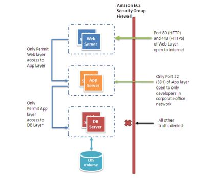

# Web Application Hosting Architecture on AWS

### Major service required to host the polarion system

* Route 53(DNS)
  * A highly available AWS Service used to server DNS requests
  * Incoming traffic is routed through Route 53 to infra running in AWS 
  * A DNS server translates the www.polarion.com address to the ip address of webserver(ex.10.1.x.x) & forwards user requests 
  * We will be using Route 53 in combination with our CloudFront distribution
* CloudFront(CDN)
  * The AWS Content Delivery Network(CDN) consists of numerous Edge locations around the world. An origin (containg our source distribution files) is created
  * When a user access a given file via our web app or otherwise, the Edge location closet to our user will be checked to see if the file exists(is cached) at that Edge if present the are immediatly accessed/downloaded and will be shared. If not present at Edge will be fetched from Origin
  * Edge caches high volume content to descres the latency to customers
* Elastic Load Balancing(ELB)/Application Load Balancer(ALB):
  * ELB will be placed to distribute traffic amoungest our Web server according to criteria we configure
  * The default ELB behaviour is Round Robin for ex: Web server1 and web server2 etc. Geo location of incoming traffic and percentage of traffic to a given web server are some examples
* Firewalls with Security Groups
  * Moves security to instances to provide a stateful, host-level firewall for both web and APp servers. 
* Region
  * A region represents specific AWS Geo location in the world - for ex, a given US state US-EAST-1
  * Each region contains 2 or more Availability Zones(AZs)
* Availability Zones(AZ)
  * A AZ represents a physical location within a given region- for ex a physical building/AWS Data centre with ina region
  * We will be going with Multi-Availability Zone Deployment which provides us High Availbility, Fault tolerance and Redundancy should something occur in a given AZ
  * Afain the AZs represent 2 distinct physical locations with in given region
* Auto Scaling Groups
  * An ASG allows us to scale our compute resources up and down automatically as needed, according to paramers we set in launch configuration while setting ASG
  * Auto Scaling is the key concept as it not only allows us the flexibility to automatically meet demand on deman, but also pay for what we use, when we use it- for example-  redus=cing comute resources(servers)by scaling down our ASG during ideal/non peak periods
  * Example: when CPU utilization >= 80% for our initial 2 web servers bring an additional web server online within the group(up-to our pre configured number) or when CPU utilization is <= 30% shutdown an instance again we pay only what we use. As stopped instance incur no charges
  * An ASG also, has ability to perform HEalth Checks on servers within the grp & start and stop instances if needed, should an instance not pass health checks 
  * ASG spans accross noth AZs
* Web Servers
  * We will places our 1st web server within our ASG in in us-east-1a AZ and secound web server within ASG in us-east-1b AZ
* App Servers:
  * We are going to use same setup for APp servers which we have used for web servers. Placing 1 app server in us-east-1a and othe in us-east-1b. For high availability, fault tolerance. 
* Amazon ElastiCache
* DB Servers
  * Our DB stores and returns ant user and/or app data needed (ex. user acc info. products, orders, etc.)
  * We are placing out Production Databse(Master) in the us-east-1a AZ and placing 2nd databse(Slave) in us-east-1b AZ for redundancy
  * we are going to synchronously replicate our data from our DB master to DB Slave for redundancy sake 
  * Should our Master DB experience a failour or the us-east-1a AZ itself experuecne any downtim we can promote our secoundary DB to Master & continue business asusual
* Simple Storage Service(S3):
  * we will be using S3 as its highly durable, cloud base object(file) storage. We sill be using it t server static content & other resources used by our web application
  * S3 is a global service it spans accross regions and AZs  
  * we will be using S3 as our Origin to store our file; and CloudFront t distribute them to users via  the nearedt Edge location   
* CloudWatch
  * We are using Cloudwatch to monitor servers and do health checks and bring a notification to admin if something fails healthchecks
* AWS Shield
  * Safeguards your infrastructure against the most common network and transport layer DDoS attacks automatically.
* AWS WAF 
  * Filters malicious traffic, including XSS and SQL injection via customer-defined rules

### Architecture

### AWS CloudTrail For Monitoring and Auditing
* CloudTrail enables continuous monitoring and post-incident forensic investigations of AWS by providing an audit trail of all activities across an AWS infrastructure. All CloudTrail logs files get stored in a dedicated S3 bucket.
  * CloudTrail provides the raw data that could be used, in conjunction with a [CASB](https://www.mcafee.com/enterprise/en-us/security-awareness/cloud/what-is-a-casb.html), to monitor user and resource activity, detect insecure or inappropriate changes to services or resources, and automate the remediation of security misconfigurations.
  * CloudTrail streamlines an organization’s compliance requirements by automating the capture and storage of logs of activities and actions taken in an AWS account. This can enable identification of events that may be out of compliance with internal policies or external regulations.
  * CloudTrail helps discover changes made to an AWS account that have the potential of putting the data or the account at heightened security risk while expediting AWS audit request fulfillment.
  * Enabling global CloudTrail logging, it will be able to generate logs for all AWS services including those that are not region specific, such as IAM, CloudFront, etc.
  * Turn on CloudTrail log file validation, any changes made to the log file itself after it has been delivered to the S3 bucket will be identifiable. This functionality provides an additional layer of protection and ensures the integrity of the log files.
  * The AWS API call history provided by CloudTrail allows security analysts to track resource changes, audit compliance, investigate incidents, and ensure security best practices are followed. By having CloudTrail enabled in all regions, organizations will be able to detect unexpected activity in otherwise unused regions.
  * CloudWatch can be used to monitor, store, and access log files from EC2 instances, CloudTrail, and other sources. With this integration, real-time and historic activity logging based on user, API, resource, and IP address is facilitated. It also supports setting up alarms and notifications for anomalous or inappropriate account activity.
  * CloudTrail S3 buckets contain the log data that is captured by CloudTrail, supporting activity monitoring and forensic investigations. By enabling access logging for CloudTrail S3 buckets, customers can track access requests and identify potentially unauthorized or unwarranted access attempts.
  * Enable MFA to delete CloudTrail buckets,  By requiring multi-factor authentication to delete an S3 bucket containing CloudTrail logs, the hacker will find it more difficult to remove the logs and remain hidden.

### Polarion Installation Guide
[Install](https://docs.plm.automation.siemens.com/content/polarion/19.1/help/en_US/polarion_trial_installation/install_polarion.html)

[Polarion Architecture](https://polarion.plm.automation.siemens.com/hubfs/Docs/Guides_and_Manuals/Polarion-High-Availability-of-the-Polarion-Server.pdf)
